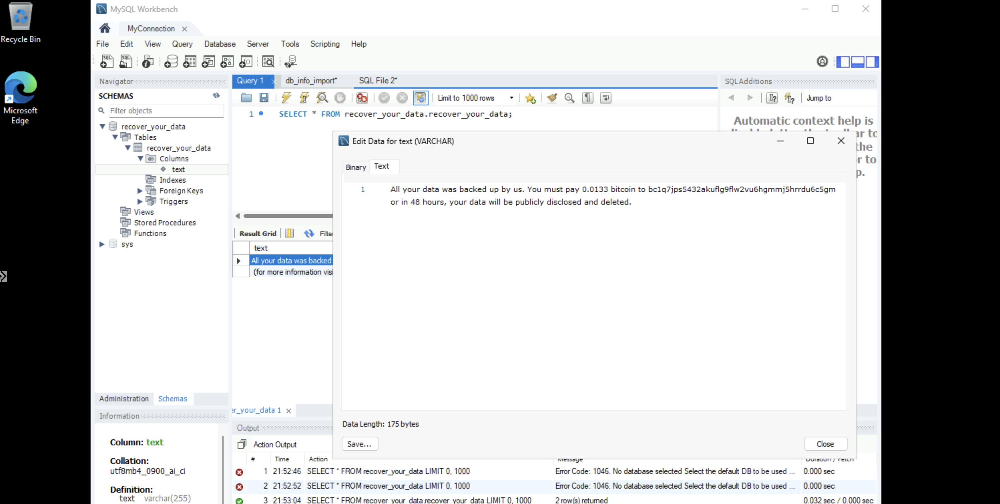
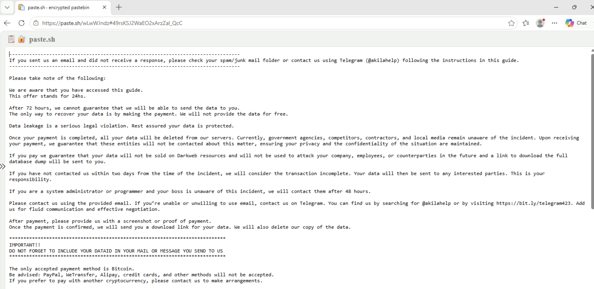
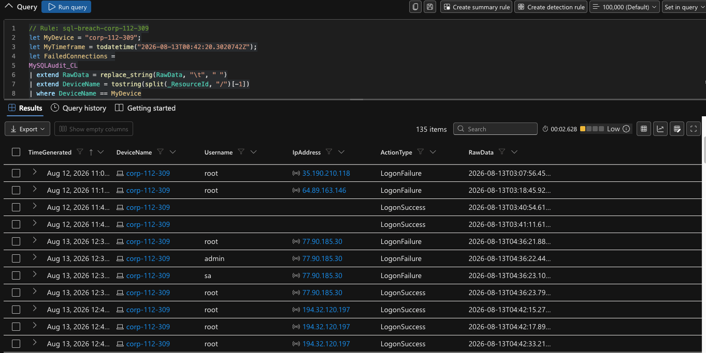
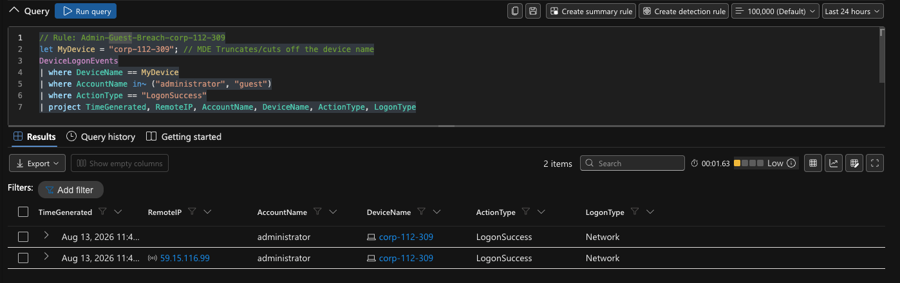
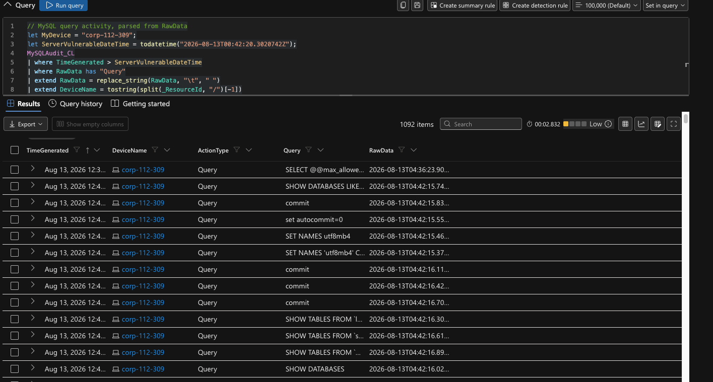
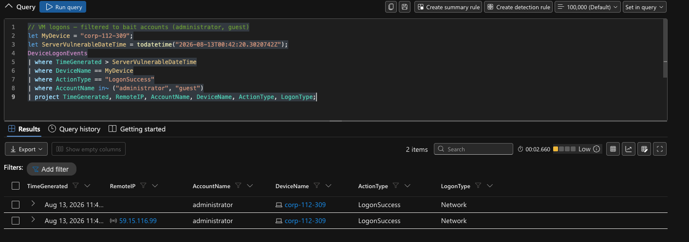
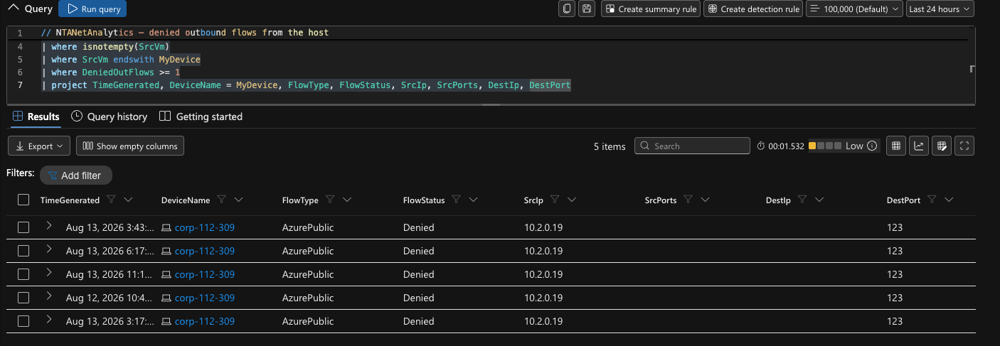

# Live-Exposed Honeypot: End-to-End Breach Detection & Incident Response with Microsoft Defender

# Incident Report: Unauthorized Access & Data Destruction — CORP-112-309

## Platforms and Languages Leveraged
- Windows 11 Pro Virtual Machine (Microsoft Azure)
- MySQL 8.0.45 / MySQL Workbench
- Microsoft Defender for Endpoint (MDE)
- Microsoft Sentinel (custom Analytics Rules)
- Log Analytics Workspace / Azure Monitor Agent (AMA)
- Kusto Query Language (KQL)
- Data Collection Rules (DCR) — custom text-log ingestion

## Scenario

This project was built inside **a live, internet-facing cyber range environment provided by LOG(N) Pacific**, following a structured, instructor-provided lab checklist (provided scripts, configs, and detection query templates). Execution, configuration, troubleshooting, and verification at every stage were done independently — this is not a self-owned Azure subscription or an original architecture design.

The goal was to build a Windows 11 honeypot running a local MySQL database, lock it down while instrumenting it, author detections *before* any exposure, and only then deliberately weaken and expose it to real internet traffic — so that any resulting breach would be caught by design, not discovered after the fact. What followed was a genuine, automated compromise: a MySQL brute-force attack, full schema destruction, a Bitcoin ransom note, and a separate successful RDP logon — all captured, correlated, and reported on using the pipeline built below.

### High-Level Detection Build Plan

- **Deploy** a Windows 11 VM in its own resource group, initially locked down with a Deny-All-Inbound NSG rule, and onboard it to Microsoft Defender for Endpoint.
- **Install and populate** MySQL 8.0.45 with a dummy schema, and enable general query logging so every connection and query is recorded to a local log file.
- **Wire** that log file into Microsoft Sentinel via a custom-text-log Data Collection Rule and the Azure Monitor Agent, landing in a custom table.
- **Author detections** — Sentinel Analytics Rules for successful bait-account VM logons and successful MySQL logons — and confirm they're quiet against a clean baseline, before any exposure.
- **Deliberately weaken and expose** the environment (bait credentials, open NSG, disabled firewall) and record the exact exposure timestamp.
- **Detect, analyze, contain, and eradicate** whatever breach follows, using the instrumented pipeline above.

---

## Steps Taken

### 1. Deployed the Honeypot VM

Deployed a Windows 11 Pro VM (`CORP-112-309`) in its own resource group, with a public IP address assigned but an explicit Deny-All-Inbound NSG rule in place. Onboarded the VM to Microsoft Defender for Endpoint and confirmed it appeared in the `DeviceInfo` table — the VM was internet-addressable but not yet reachable.

### 2. Installed and Instrumented MySQL

Installed MySQL 8.0.45 (via MySQL Workbench) and imported a dummy dataset across three schemas. Enabled general query logging so every connection (success and failure) and every query would be written to a local log file, then confirmed the log was capturing activity.

### 3. Wired MySQL Logs Into Microsoft Sentinel

Created a custom-text-log Data Collection Rule pointing the Azure Monitor Agent at the MySQL log file, landing the data in a custom table inside a shared Log Analytics Workspace. Verified ingestion with a scoped KQL query filtered to this VM's resource ID (the workspace is shared across multiple participants, so every query in this project filters explicitly to avoid pulling in other hosts' data).

### 4. Authored Detections Before Any Exposure

Built two Sentinel Analytics Rules while the environment was still clean:
- A rule detecting successful logons to the bait `administrator`/`guest` accounts on the VM.
- A rule parsing the raw MySQL connection log to detect successful authentications, distinguishing them from failed attempts via connection-ID correlation.

Full text of both rules, and every other query used in this project, is in the **KQL Detection Queries** section below, each immediately followed by its result screenshot.

### 5. Deliberately Weakened and Exposed the Environment

Only after the detections above were confirmed quiet against a clean baseline: enabled a weak local `administrator` account, enabled a blank-password `guest` account with RDP access, created a second network-reachable MySQL account (`root@'%'`, password `root`) as bait, disabled the Windows Firewall, and opened the NSG to Allow-All-Inbound. The exact exposure timestamp was recorded to mark the start of the incident window.

### 6. Detected the Breach

Within hours, the MySQL bait account was brute-forced from 13 distinct external IPs. Two sessions escalated to full schema destruction: one enumerated and dropped every table across all three schemas, a second recreated a `RECOVER_YOUR_DATA` table and inserted a Bitcoin ransom note, then modified the bait account's privileges. Separately, the local `administrator` account was successfully logged into over RDP from an external IP — a distinct compromise on the Windows side.



The ransom note referenced an external landing page, accessed for evidence-gathering purposes only (no payment or contact made), which detailed the extortion group's payment instructions and a secondary Telegram contact channel:



The detection queries that surfaced this activity — the standing analytics rules, the MySQL query-activity check, the bait-account logon check, and the outbound-traffic check — are documented with their full query text and result screenshots in the **KQL Detection Queries** section below.

A follow-up hunt checking whether the `administrator` RDP session was followed by any hands-on-keyboard process activity returned zero rows — the successful logon was not followed by observable interactive activity in the following six hours. See that query in the KQL section as well.

### 7. Contained the Breach

Isolated the VM in Microsoft Defender for Endpoint (full isolation) and captured a second Investigation Package for before/after forensic comparison against the one taken pre-exposure. Confirmed no further logons occurred on the host after isolation — see the post-isolation containment check in the KQL section below.

### 8. Eradicated and Recovered

Chose to harden and restore rather than destroy and rebuild: reverted the NSG, re-enabled the Windows Firewall, ran a full Defender malware scan, deleted the bait `administrator` account, disabled `guest`, rotated the primary local account to strong credentials, closed MySQL off from the public internet, remediated the bait `root@'%'` account, and restored the MySQL schema from the original seed data.

---

## KQL Detection Queries

All queries below were actually run against this environment (not hypothetical examples), each scoped to this VM's device name or resource ID to isolate results within the shared Log Analytics Workspace. Each query is immediately followed by its result screenshot.

**Standing rule — successful MySQL logon (`sql-breach-corp-112-309`).** This is the query that flagged the real compromise.
```kql
// Rule: sql-breach-corp-112-309
let MyDevice = "corp-112-309";
let MyTimeframe = todatetime("2026-08-13T00:42:20.3020742Z");
let FailedConnections =
MySQLAudit_CL
| extend RawData = replace_string(RawData, "\t", " ")
| extend DeviceName = tostring(split(_ResourceId, "/")[-1])
| where DeviceName == MyDevice
| where RawData has "Access denied"
| extend ConnectionId = extract(@"^\S+\s+(\d+)\s+Connect", 1, RawData)
| distinct ConnectionId;
MySQLAudit_CL
| where TimeGenerated > MyTimeframe
| extend RawData = replace_string(RawData, "\t", " ")
| extend DeviceName = tostring(split(_ResourceId, "/")[-1])
| where DeviceName == MyDevice
| where RawData has "Connect"
| extend ConnectionId = extract(@"^\S+\s+(\d+)\s+Connect", 1, RawData)
| extend ActionType =
    case(
        RawData has "Access denied", "LogonFailure",
        ConnectionId in (FailedConnections), "Ignore",
        "LogonSuccess"
    )
| where ActionType != "Ignore"
| extend Username = replace_string(tostring(split(tostring(split(RawData,"@")[0]), " ")[-1]), "'", "")
| extend IpAddress = replace_string(tostring(split(split(RawData,"@")[1], " ")[0]), "'", "")
| project TimeGenerated, DeviceName, Username, IpAddress, ActionType, RawData
| order by TimeGenerated desc
```


**Standing rule — successful VM logon to bait accounts (`Admin-Guest-Breach-corp-112-309`).**
```kql
// Rule: Admin-Guest-Breach-corp-112-309
let MyDevice = "corp-112-309"; // MDE Truncates/cuts off the device name
DeviceLogonEvents
| where DeviceName == MyDevice
| where AccountName in~ ("administrator", "guest")
| where ActionType == "LogonSuccess"
| project TimeGenerated, RemoteIP, AccountName, DeviceName, ActionType, LogonType
```


**MySQL query-level activity from the point of exposure onward.**
```kql
// MySQL query activity, parsed from RawData
let MyDevice = "corp-112-309";
let ServerVulnerableDateTime = todatetime("2026-08-13T00:42:20.3020742Z");
MySQLAudit_CL
| where TimeGenerated > ServerVulnerableDateTime
| where RawData has "Query"
| extend RawData = replace_string(RawData, "\t", " ")
| extend DeviceName = tostring(split(_ResourceId, "/")[-1])
| where DeviceName == MyDevice
| extend ActionType = "Query"
| extend Query = split(RawData, "Query")[1]
| project TimeGenerated, DeviceName, ActionType, Query, RawData
| order by TimeGenerated desc
```


**Ad hoc check — successful bait-account VM logons during active monitoring.**
```kql
// VM logons — filtered to bait accounts (administrator, guest)
let MyDevice = "corp-112-309";
let ServerVulnerableDateTime = todatetime("2026-08-13T00:42:20.3020742Z");
DeviceLogonEvents
| where TimeGenerated > ServerVulnerableDateTime
| where DeviceName == MyDevice
| where ActionType == "LogonSuccess"
| where AccountName in~ ("administrator", "guest")
| project TimeGenerated, RemoteIP, AccountName, DeviceName, ActionType, LogonType;
```


**Denied outbound network flows (checking for attempted C2/exfiltration).**
```kql
// NTANetAnalytics — denied outbound flows from the host
let MyDevice = "corp-112-309";
NTANetAnalytics
| where isnotempty(SrcVm)
| where SrcVm endswith MyDevice
| where DeniedOutFlows >= 1
| project TimeGenerated, DeviceName = MyDevice, FlowType, FlowStatus, SrcIp, SrcPorts, DestIp, DestPort
```


Result: 5 denied flows, all benign NTP (UDP/123) from the host itself — no attacker-attributable outbound activity.

**Ad hoc hunt — administrator-attributed process activity following the RDP logon.**
```kql
let MyDevice = "corp-112-309";
let LogonTime = todatetime("2026-08-13T11:46:03Z");
DeviceProcessEvents
| where DeviceName == MyDevice
| where TimeGenerated between (LogonTime - 5m .. LogonTime + 6h)
| where AccountName =~ "administrator" or InitiatingProcessAccountName =~ "administrator"
| project TimeGenerated, AccountName, FileName, ProcessCommandLine
```
Result: no rows returned — the successful RDP logon was not followed by observable hands-on-keyboard activity. (No screenshot for this query — an empty result set has nothing to capture.)

**Post-isolation containment check.**
```kql
let MyDevice = "corp-112-309";
let IsolationTime = todatetime("2026-08-13T21:58:22.9317788Z");
DeviceLogonEvents
| where DeviceName == MyDevice
| where TimeGenerated > IsolationTime
| project TimeGenerated, AccountName, RemoteIP, ActionType, LogonType
| order by TimeGenerated asc
```
Result: no rows returned — no logons occurred on this host after isolation. (No screenshot for this query — an empty result set has nothing to capture.)

---

## MITRE ATT&CK Mapping

The activity observed in this incident closely matches a pattern well-documented in threat intelligence: opportunistic, internet-scanning-driven attacks against exposed database services, where automated tooling discovers an open port, brute-forces default or weak credentials, and — rather than deploying traditional ransomware — wipes the data outright and leaves an extortion note demanding payment for its "return." This is distinct from a targeted ransomware operator; the credential-guessing pattern spread across 13 unrelated source IPs, the templated ransom-note wording, and the destructive rather than encrypting payload all point to mass, automated tooling rather than a human operator specifically targeting this host.

| Tactic | Technique | ID | Evidence in this incident |
|---|---|---|---|
| Reconnaissance | Active Scanning | T1595 | 13 distinct source IPs authenticating against default-style usernames (`root`, `sa`, `admin`) within a short window — consistent with mass internet-wide port scanning rather than targeted recon |
| Credential Access | Brute Force | T1110 | 104 MySQL authentication events (45 failures, 59 successes) across those same 13 IPs |
| Initial Access / Persistence | Valid Accounts | T1078 | Bait credential `root@'%'` (password `root`) used to authenticate and drive all subsequent destructive activity |
| Impact | Data Destruction | T1485 | All tables across the `lnp_corp`, `sakila`, and `world` schemas dropped |
| Impact | Extortion via ransom note | — | `RECOVER_YOUR_DATA` table inserted post-deletion containing a Bitcoin payment demand, contact email, and unique DATAID reference |

*Note: exact technique IDs should be cross-checked against the current MITRE ATT&CK matrix (attack.mitre.org) before citing in a resume, application, or formal writeup — sub-technique numbering is occasionally revised between ATT&CK versions.*

---

## Timeline of Build Events

1. **VM Deployed** — Windows 11 VM created in its own resource group, Deny-All-Inbound NSG, onboarded to MDE.
2. **MySQL Installed & Instrumented** — MySQL 8.0.45 installed, dummy schema imported, general query logging enabled and persisted.
3. **Log Pipeline Wired** — Custom-text-log DCR built, MySQL logs confirmed flowing into a custom Log Analytics table.
4. **Detections Authored** — Two Sentinel Analytics Rules built and confirmed quiet against a clean, pre-exposure baseline.
5. **Environment Weakened & Exposed** — Bait credentials created, firewall disabled, NSG opened; exact exposure timestamp recorded.
6. **Breach Detected** — MySQL brute-force and schema destruction observed; separate successful RDP logon to the bait `administrator` account confirmed.
7. **Breach Contained** — VM isolated via Defender; second Investigation Package captured; no further logons confirmed post-isolation.
8. **Eradication & Recovery** — Environment hardened, bait accounts remediated, MySQL data restored from seed.

---

## Summary

This project stood up a Windows 11 + MySQL honeypot inside a live, internet-facing cyber range environment, instrumented it end-to-end with Microsoft Defender for Endpoint and a custom MySQL log pipeline into Microsoft Sentinel, and authored detection rules *before* any deliberate exposure — so that a real compromise, when it happened, would be caught by design. Within hours of exposure, an automated actor brute-forced a bait MySQL account, destroyed three schemas, and left a Bitcoin ransom note, while a separate successful RDP logon compromised the bait `administrator` account. The full incident — detection, IOC extraction, timeline reconstruction, containment, and eradication — was documented in a formal incident report, grounded entirely in real telemetry pulled from `MySQLAudit_CL`, `DeviceLogonEvents`, `DeviceProcessEvents`, and `NTANetAnalytics`.

---

## Lessons Learned

- **Full-lifecycle detection engineering** — authoring and validating Sentinel Analytics Rules *before* exposure, rather than reactively after a breach, made a real, concrete difference: the standing `sql-breach-corp-112-309` rule was the exact query that flagged the compromise.
- **Reading attacker behavior from raw telemetry** — distinguishing an automated, opportunistic scanner from a more deliberate, multi-step destructive session came directly from correlating timestamps, source IPs, and command sequences across `MySQLAudit_CL`, not from any single alert.
- **Working inside a shared, multi-tenant Log Analytics Workspace** — every query in this project had to explicitly scope to this VM's `_ResourceId`, since the workspace contains telemetry from every participant in the range; a good practical lesson in the difference between "my data" and "queryable data."
- **Full incident lifecycle experience** — detection, IOC extraction, timeline reconstruction, containment via Defender isolation, and a genuine harden-and-restore eradication path (rather than a simpler destroy-and-rebuild), closer to how a real production incident would actually be handled.

---

## Response / Next Steps

- Build a Sentinel Analytics Rule specifically targeting the ransom-table creation pattern observed in this incident (`CREATE TABLE ... RECOVER_YOUR_DATA`, extortion-note inserts), to reduce detection time from manual log review to near-real-time alerting.
- Preserve host-based firewall logging independent of firewall blocking policy, so connection-level evidence isn't lost if the firewall itself is disabled during an exposure window.
- Validate recovery procedures against true point-in-time backups rather than original seed data, to more realistically exercise the recovery step of the incident lifecycle.
- Re-run the same pipeline with a shorter, time-boxed exposure window to test whether high-value findings can be captured with less live-exposure time.
